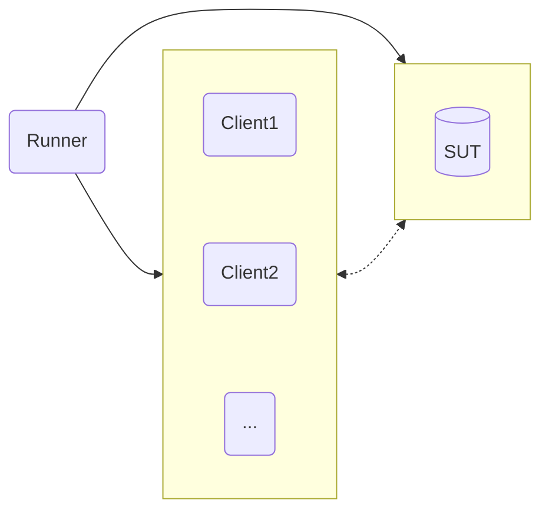

# Ampere Performance Toolkit

Ampere Performance Toolkit (APT) is a fork of PerfKitBenchmarker from GCP: https://github.com/GoogleCloudPlatform/PerfKitBenchmarker

- APT Version: 1.0.0
- Upstream Google PerfKitBenchmarker commit SHA: 0fc45c45a25657aa0634ae06cace08cb79e7803b

Features Added

- Oracle Cloud Infrastructure (OCI) support as a provider
    - APT can automatically provision/cleanup VMs, VCNs, etc. through OCI for workload runs
- Additional support for BareMetal testing
- IRQ binding for experimentation with network intensive workloads
- A global tuning module that enables declarative bash commands from yaml configs on all systems involved in a test
- Max throughput mode for key workloads to determine the best throughput possible under a given SLA

In summary, APT is great at capturing all workload parameters and system-under-test parameters in a single, re-playable,
yaml file.

- See [Contribution Guide](ampere/pkb/docs/CONTRIBUTING.md) for issues, features requests, and questions 
- See [Guides](ampere/pkb/docs/guides) for various guides, tips, and tricks

# Licensing

Ampere Performance Toolkit provides wrappers and workload definitions around popular
benchmark tools. We made it very simple to use and automate everything we can.
It instantiates VMs on the Cloud provider of your choice, automatically installs
benchmarks, and runs the workloads without user interaction.

Due to the level of automation you will not see prompts for software installed
as part of a benchmark run. Therefore you must accept the license of each of the
benchmarks individually, and take responsibility for using them before you use
the Ampere Performance Toolkit. 

In its current release these are the benchmarks that are executed and their associated license terms:

- `cassandra`: [Apache v2](https://github.com/apache/cassandra/blob/trunk/LICENSE.txt)
- `tlp-stress`: [Apache v2](https://github.com/thelastpickle/tlp-stress/blob/master/LICENSE.txt)
- `ffmpeg`: [LGPL with optional components licensed under GPL](https://github.com/FFmpeg/FFmpeg/blob/master/LICENSE.md)
- `memtier_benchmark`: [GPL v2](https://github.com/RedisLabs/memtier_benchmark?tab=GPL-2.0-1-ov-file)
- `mysql`: [GPL v2](https://github.com/mysql/mysql-server/blob/trunk/LICENSE)
- `nginx`: [BSD-2-Clause](https://github.com/nginx/nginx/blob/master/LICENSE)
- `openssl`: [Apache v2](https://github.com/openssl/openssl/blob/master/LICENSE.txt)
- `redis`: Dual-licensing model with [RSALv2 and SSPLv1](https://github.com/redis/redis/blob/unstable/LICENSE.txt)
- `sysbench`: [GPL v2](https://github.com/akopytov/sysbench?tab=GPL-2.0-1-ov-file#readme)
- `wrk`: [Apache v2](https://github.com/wg/wrk/blob/master/LICENSE)

# APT: Overview, Setup, and Usage

## Overview

APT runs on a separate system from the system-under-test (SUT), and sends commands over SSH to the SUT to perform benchmarks. The steps in this guide will help to prepare a new APT runner system.

### Test Topology

A minimum of 2+ systems is required for APT. 

The simplest configuration would consist of one runner system and one system-under-test (SUT) for single-node tests. 

A more involved configuration might consist of one runner system, one SUT, and one or more clients (depending on the workload).



### Prerequisites
*For BareMetal / Static VM Tests*
- Passwordless SSH configured
  - Runner -> SUT
  - Runner -> Client(s)
  - See [here](ampere/pkb/docs/guides/passwordless-ssh.md) for more details
- Passwordless sudo granted to user on...
  - SUT
  - Client(s)
  - Required for package installation / builds
- Firewall disabled between SUT and Client(s)

*For Cloud-based Tests*
- APT will automatically create the system(s) and SSH keys required for connection under the hood (given a valid cloud YAML config) 


## Dependencies

APT requires Python 3.11 and above, pip for package management, and a virtual environment for dependencies. Check the current version on your runner system with `python3 --version`. 

If the system does not already have Python 3.11 or higher, install it explicitly, e.g. *Fedora 38*

```bash
sudo dnf install python3.11
```

If Nix or NixOS is installed, `nix develop` can be used to be dropped into a development shell which can run APT without venv.

## Setup APT

Create a new virtual environment

```bash
python3.11 -m venv apt_venv
```

Start the virtual environment

```bash
source apt_venv/bin/activate
```

Upgrade pip inside virtual environment (important)

```bash
python3.11 -m pip install --upgrade pip
```

Clone the Ampere Performance Toolkit (APT) repository 

Next, `cd` into the root of project directory

Then, install requirements (while venv is running!)

```bash
pip install -r requirements.txt
```

- There may be a warning during install about "timeout-decorator being installed using legacy 'setup.py install' method", which is safe to ignore 


## Usage

### The 5 Stages of a PerfKitBenchmarker run


To initiate all phases, simply call APT with the workload and config of your choice. Run from the root of the project directory and be sure the virtual envirnoment is active.

```bash
./pkb.py --benchmarks=<benchmark_name> --benchmark_config_file=<path_to_config>
```

e.g. to run NGINX and wrk with an existing YAML config
```bash
./pkb.py --benchmarks=ampere_nginx_wrk --benchmark_config_file=./ampere/pkb/configs/example_nginx.yml
```

For more details about setting up a BareMetal run, see the [BareMetal Getting Started Guide](ampere/pkb/docs/guides/baremetal-getting-started.md)

For more details about setting up cloud-based runs on OCI, see the [OCI Getting Started Guide](ampere/pkb/docs/guides/oci-getting-started.md)

**YAML Configs**

Each YAML config file represents a workload configuration for a certain system(s) and environment
- The path to the configuration file in the run command can be relative or absolute
- The benchmark name must match the name defined in the YAML config

### A few useful PerfKitBenchmarker flags

| Flag | Description |
| ---- | ----------- |
| `--run_stage_iterations=<n>` | Execute the run stage N times in a row |
| `--run_stage=<provision,prepare,run,cleanup,teardown>` | Run in stages, useful for monitoring/debugging between runs |
|`--helpmatch=ampere`|Searches and matches any flag that has been implemented by Ampere with a description on how to use it. You can use the `.` notation to drill down in to specific flags you're interested in. E.G. `./pkb.py --helpmatch=ampere.pkb.linux_packages.redis` will return all the associated `ampere_redis_server` flags for running `ampere_redis_memtier`|

Usage example:
1. Pass `--run_stage=provision,prepare`
2. Save the `run_uri` generated at the end of this first pass
3. Connect to SUT for debugging/monitoring
4. Pass `--run_stage=run --run_uri=<run_uri>` to repeat testing manually N times
5. Pass `--run_stage=cleanup,teardown --run_uri<run_uri>` when ready to finish

## Results

To deactivate virtual environment

`deactivate`

All test results, logs, Ampere System Dump results, etc. can be found in

`/tmp/perfkitbenchmarker/runs/<run_uri>`

This directory (with correct run_uri) will be output to the console at the end of each test run.
